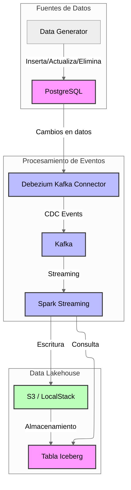

# Guión para Video de 90 Segundos

## Título: "Arquitectura Data Lakehouse con CDC y Apache Iceberg: Potenciado por Amazon Q Developer"

### [0-10 segundos]
**Presentador:** "Bienvenidos a esta breve presentación sobre nuestra arquitectura de Data Lakehouse. Hoy veremos cómo capturamos cambios en bases de datos relacionales y los almacenamos en un formato moderno para análisis."

**Pantalla:** Título del video y logo del proyecto Lakehouse.

### [10-20 segundos]
**Presentador:** "¿Sabías que CDC o Change Data Capture puede capturar cambios en bases de datos sin afectar su rendimiento? Esta técnica identifica y captura modificaciones para su procesamiento posterior. Apache Iceberg es un formato de tabla de alto rendimiento que ofrece control de versiones y evolución de esquema."

**Pantalla:** Infografía simple explicando CDC e Iceberg con sus principales ventajas.

### [20-30 segundos]
**Presentador:** "Para desarrollar esta arquitectura, utilizamos Amazon Q Developer, que nos ayudó a generar código como este para la integración de Spark con Iceberg, ahorrando horas de desarrollo."

**Pantalla:** Captura de pantalla mostrando una consulta a Amazon Q Developer: "Escribe código para configurar Spark con Apache Iceberg y S3" y la respuesta generada.

### [30-45 segundos]
**Presentador:** "Nuestra arquitectura se compone de tres capas: fuentes de datos con PostgreSQL, procesamiento de eventos con Debezium y Kafka, y almacenamiento en formato Iceberg en S3 con Spark streaming."

**Pantalla:** Diagrama de arquitectura completo, resaltando cada capa mientras se menciona.

### [45-55 segundos]
**Presentador:** "¿Sabías que Apache Iceberg permite viajes en el tiempo a través de tus datos? Debezium captura los cambios en PostgreSQL mediante CDC y los envía a Kafka. Spark Streaming consume estos eventos y los escribe en tablas Iceberg en S3, preservando todo el historial de cambios."

**Pantalla:** Zoom al flujo PostgreSQL → Debezium → Kafka → Spark → S3/Iceberg con una visualización de "time travel" en datos.

### [55-70 segundos]
**Presentador:** "Veamos una demostración rápida. Al insertar datos en PostgreSQL, Amazon Q Developer nos ayudó a generar el código para capturar estos eventos y procesarlos automáticamente hasta llegar a nuestra tabla Iceberg."

**Pantalla:** Terminal dividida mostrando:
1. Inserción en PostgreSQL: `INSERT INTO users (name) VALUES ('Juan García');`
2. Código generado por Amazon Q Developer para procesar eventos
3. Consulta a tabla Iceberg mostrando los datos capturados

### [70-80 segundos]
**Presentador:** "¿Sabías que Amazon Q Developer puede reducir hasta un 70% el tiempo de desarrollo? Fue crucial para resolver desafíos como la configuración de Spark con S3 y la escritura en Iceberg, tareas que normalmente tomarían días."

**Pantalla:** Fragmento de código generado por Amazon Q Developer para la escritura en Iceberg:
```python
def write_to_iceberg(batch_df, batch_id, spark):
    batch_df.write.format("iceberg").mode("append").save("lakehouse_db.raw_events_iceberg")
```

### [80-90 segundos]
**Presentador:** "Esta arquitectura nos permite construir un data lakehouse moderno, combinando lo mejor de los data lakes y data warehouses: escalabilidad, flexibilidad y rendimiento. Gracias a Amazon Q Developer, pudimos implementarla en una fracción del tiempo habitual."

**Pantalla:** Diagrama completo con un banner: "Desarrollo acelerado con Amazon Q Developer" y los beneficios clave del sistema.

# Diagrama de Arquitectura del Sistema Lakehouse



## Descripción de los Componentes

### Fuentes de Datos
- **PostgreSQL**: Base de datos relacional que almacena los datos transaccionales.
- **Data Generator**: Servicio que genera datos de prueba insertando, actualizando y eliminando registros en PostgreSQL.

### Procesamiento de Eventos
- **Debezium Connector**: Captura los cambios en la base de datos PostgreSQL (CDC - Change Data Capture).
- **Kafka**: Sistema de mensajería que recibe los eventos CDC y los distribuye.
- **Spark Streaming**: Procesa los eventos en tiempo real desde Kafka.

### Data Lakehouse
- **S3 (LocalStack)**: Almacenamiento de objetos compatible con S3 para guardar los datos en formato Iceberg.
- **Tabla Iceberg**: Formato de tabla de código abierto que proporciona control de versiones, evolución de esquema y consultas rápidas.

## Flujo de Datos

1. El **Data Generator** inserta, actualiza o elimina registros en la tabla `users` de **PostgreSQL**.
2. **Debezium** (a través de Kafka Connect) captura estos cambios y los publica como eventos CDC en un topic de **Kafka**.
3. **Spark Streaming** consume estos eventos desde Kafka.
4. Spark procesa los eventos y los escribe en formato **Iceberg** en **S3** (LocalStack).
5. Los datos almacenados en formato Iceberg pueden ser consultados posteriormente mediante Spark.

## Interacción entre Componentes

- **PostgreSQL → Debezium**: PostgreSQL está configurado con `wal_level=logical` para permitir la replicación lógica que Debezium utiliza para capturar cambios.
- **Debezium → Kafka**: Los eventos CDC se publican en el topic `postgres.public.users`.
- **Kafka → Spark**: Spark Streaming consume los eventos del topic de Kafka.
- **Spark → S3**: Spark escribe los eventos en formato Iceberg en S3.
- **S3 → Iceberg**: Los metadatos y datos de las tablas Iceberg se almacenan en S3.