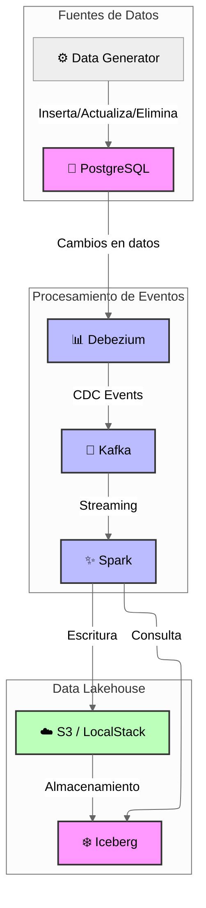

# Guión para Video de 90 Segundos

## Título: "Arquitectura Data Lakehouse con CDC y Apache Iceberg: Potenciado por Amazon Q Developer"

### [0-10 segundos]
**Presentador:** "Hola a todos. Hoy les voy a contar cómo crear un data lakehouse realmente potente. Lo interesante es que lo hicimos en tiempo récord gracias a Amazon Q Developer. Vamos a ver cómo capturamos cambios en una base de datos relacional y los transformamos en algo realmente útil."

**Pantalla:** Título del video y logo del proyecto Lakehouse con estilo moderno.

### [10-20 segundos]
**Presentador:** "¿Sabías que CDC o Change Data Capture funciona como una cámara de seguridad para tu base de datos? Captura todos los cambios en los datos sin afectar el rendimiento de la base de datos. Por otra parte, Apache Iceberg es como un sistema de control de versiones para tus datos. Imagina poder volver a cualquier punto en el tiempo de tu información."

**Pantalla:** Infografía clara explicando CDC e Iceberg con sus principales ventajas.

### [20-30 segundos]
**Presentador:** "Le pedí a Amazon Q Developer que me ayudara con el código para conectar Spark con Iceberg y en segundos me generó la solución. Me ahorró días de trabajo."

**Pantalla:** Captura de pantalla mostrando una conversación real con Amazon Q Developer con la respuesta generada.

### [30-45 segundos]
**Presentador:** "La arquitectura propuesta es muy eficiente: tenemos Postgres guardando los datos, Debezium y Kafka moviendo los cambios en tiempo real, y todo termina en tablas de Iceberg en S3 generando una línea de producción de datos bien definida."

**Pantalla:** Diagrama de arquitectura con los iconos mostrando el flujo de datos.

### [45-55 segundos]
**Presentador:** "¿Sabías que con Iceberg puedes prácticamente viajar en el tiempo a través de tus datos? Es como tener una máquina del tiempo. Debezium captura cada cambio en Postgres, Kafka lo distribuye, y Spark lo guarda todo en Iceberg. Así conservas la historia completa de tus datos."

**Pantalla:** Visualización mostrando cómo los datos evolucionan y se pueden consultar en diferentes momentos.

### [55-70 segundos]
**Presentador:** "Veamos esto en acción. Cuando insertamos datos en Postgres, observa lo que sucede. Todo el camino hasta Iceberg ocurre automáticamente. Y todo este código lo generó Amazon Q Developer usando algunos prompts."

**Pantalla:** Terminal con comandos ejecutándose, mostrando el flujo completo de datos con visualizaciones claras.

### [70-80 segundos]
**Presentador:** "¿Sabías que Amazon Q Developer me ahorra un gran porcentaje del tiempo? Cuando me enfrenté a la  configuración de Spark con Iceberg y S3, simplemente le pregunté a Q y obtuve la solución. Resuelto en minutos lo que normalmente me llevaría días."

**Pantalla:** Comparación visual de "Antes vs Después de Amazon Q Developer" mostrando el código generado con un contador de tiempo ahorrado.

### [80-90 segundos]
**Presentador:** "Y con esto concluimos. Un data-lakehouse moderno construido en tiempo récord. Escalable, flexible y de alto rendimiento. Amazon Q Developer fue como tener un experto en cada tecnología disponible. El resultado: semanas de trabajo completadas en días."

**Pantalla:** Diagrama final con un banner: "Desarrollo acelerado con Amazon Q Developer" y los beneficios clave resaltados con iconos profesionales.

# Diagrama de Arquitectura del Sistema Lakehouse

```mermaid
---
config:
  theme: neutral
  look: classic
  layout: elk
---
flowchart TD
    subgraph subGraph0["Fuentes de Datos"]
        PG["🐘 PostgreSQL"]
        DG["⚙️ Data Generator"]
    end
    subgraph subGraph1["Procesamiento de Eventos"]
        DEB["📊 Debezium"]
        KAFKA["🚀 Kafka"]
        SPARK["✨ Spark"]
    end
    subgraph subGraph2["Data Lakehouse"]
        S3["☁️ S3 / LocalStack"]
        ICEBERG["❄️ Iceberg"]
    end
    PG -- Cambios en datos --> DEB
    DEB -- CDC Events --> KAFKA
    KAFKA -- Streaming --> SPARK
    SPARK -- Escritura --> S3
    SPARK -- Consulta --> ICEBERG
    S3 -- Almacenamiento --> ICEBERG
    DG -- Inserta/Actualiza/Elimina --> PG
    PG:::database
    DEB:::processing
    KAFKA:::processing
    SPARK:::processing
    S3:::storage
    ICEBERG:::database
    classDef database fill:#f9f,stroke:#333,stroke-width:2px
    classDef processing fill:#bbf,stroke:#333,stroke-width:2px
    classDef storage fill:#bfb,stroke:#333,stroke-width:2px
```

## Descripción de los Componentes

### Fuentes de Datos
- **PostgreSQL**: Base de datos relacional que almacena los datos transaccionales.
- **Data Generator**: Servicio que genera datos de prueba insertando, actualizando y eliminando registros en PostgreSQL.

### Procesamiento de Eventos
- **Debezium Connector**: Captura los cambios en la base de datos PostgreSQL (CDC - Change Data Capture).
- **Kafka**: Sistema de mensajería que recibe los eventos CDC y los distribuye.
- **Spark Streaming**: Procesa los eventos en tiempo real desde Kafka.

### Data Lakehouse
- **S3 (LocalStack)**: Almacenamiento de objetos compatible con S3 para guardar los datos en formato Iceberg.
- **Tabla Iceberg**: Formato de tabla de código abierto que proporciona control de versiones, evolución de esquema y consultas rápidas.

## Flujo de Datos

1. El **Data Generator** inserta, actualiza o elimina registros en la tabla `users` de **PostgreSQL**.
2. **Debezium** (a través de Kafka Connect) captura estos cambios y los publica como eventos CDC en un topic de **Kafka**.
3. **Spark Streaming** consume estos eventos desde Kafka.
4. Spark procesa los eventos y los escribe en formato **Iceberg** en **S3** (LocalStack).
5. Los datos almacenados en formato Iceberg pueden ser consultados posteriormente mediante Spark.

## Interacción entre Componentes

- **PostgreSQL → Debezium**: PostgreSQL está configurado con `wal_level=logical` para permitir la replicación lógica que Debezium utiliza para capturar cambios.
- **Debezium → Kafka**: Los eventos CDC se publican en el topic `postgres.public.users`.
- **Kafka → Spark**: Spark Streaming consume los eventos del topic de Kafka.
- **Spark → S3**: Spark escribe los eventos en formato Iceberg en S3.
- **S3 → Iceberg**: Los metadatos y datos de las tablas Iceberg se almacenan en S3.